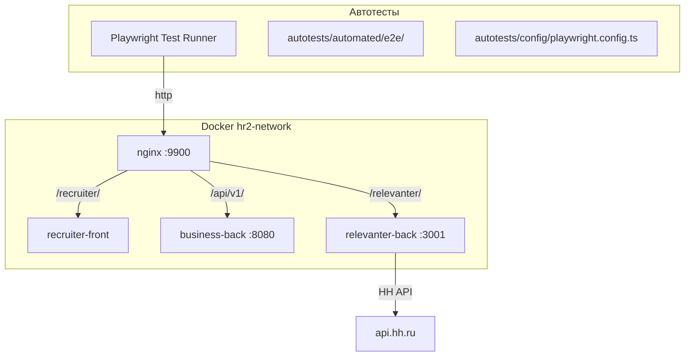

# ТЗ: E2E автотесты на Playwright

## Краткое описание
Создание инфраструктуры и набора E2E автотестов на Playwright для ключевых бизнес-сценариев рекрутера: авторизация, навигация по вакансиям, редактирование вакансии, экспорт на HH.ru.

## Цель
Автоматизировать ручное тестирование критичных пользовательских сценариев, чтобы:
- Ловить регрессии при изменениях в recruiter-front и relevanter-back
- Сократить время ручного тестирования перед релизами
- Обеспечить воспроизводимость тестов в CI/CD

## Архитектурная схема

## Текущее состояние

### Что уже есть:
- Папка `autotests/` в корне hr-recruiter2 с базовой структурой (test-cases, results, templates)
- 1 ручной тест-кейс: TC-001 — навигация к форме редактирования вакансии (QMD, подробные селекторы)
- Юнит-тесты в relevanter-back: 177 тестов (Jest)
- Юнит-тесты в business-back: JUnit (Maven)

### Чего нет:
- `playwright.config.ts` — конфигурация Playwright
- `package.json` в autotests/ — зависимости
- Папка `automated/` — автоматизированные тесты (.spec.ts)
- CI/CD интеграция

## Функциональные требования

### FR-1: Инфраструктура Playwright
- ✅ `autotests/package.json` с зависимостью `@playwright/test`
- ✅ `autotests/config/playwright.config.ts` с baseURL = `http://host.docker.internal:9900`
- ✅ `autotests/automated/e2e/` — папка для E2E тестов
- ✅ npm-скрипты: `test`, `test:headed`, `test:report`

### FR-2: Хелпер авторизации
- ✅ Общий хелпер/фикстура для логина (admin@example.com / admin)
- ✅ Сохранение auth state для переиспользования между тестами
- ✅ Навигация на главную страницу после логина

### FR-3: Тест — Навигация к форме вакансии
- ✅ Автоматизация существующего TC-001 (навигация к форме редактирования)
- ✅ Проверка: логин → сайдбар → страница вакансии → форма редактирования
- ✅ Проверка наличия основных секций формы
- ✅ Проверка предзаполненных данных (название, зарплата)

### FR-4: Тест — Soft validation на форме вакансии
- ✅ Ввод title > 100 символов → amber предупреждение
- ✅ Очистка описания до < 200 символов → предупреждение
- ✅ Добавление > 1 специализации → предупреждение
- ✅ Проверка что предупреждения исчезают при корректных данных

### FR-5: Тест — Сохранение вакансии
- ✅ Изменение полей (название, зарплата) → кнопка "Сохранить" → успех
- ✅ Проверка что данные сохранились (перезагрузка формы)
- ✅ Кнопка "Отмена" — возврат без сохранения

### FR-6: Тест — Экспорт/обновление на HH.ru (если вакансия привязана к HH)
- ✅ Нажать "Обновить на HH.ru" → диалог подтверждения
- ✅ Проверка toast-сообщений (успех или ошибки валидации)
- ✅ Проверка отображения ошибок от backend (validationErrors)

## Технические требования
- 🔧 Playwright ^1.49
- 🔧 TypeScript для тестов
- 🔧 baseURL через переменную окружения (по умолчанию `http://host.docker.internal:9900`)
- 🔧 Стабильные селекторы: `data-testid`, `aria-label`, `role`, `text` (НЕ ref)
- 🔧 Скриншоты при падении теста
- 🔧 HTML-отчёт после прогона

## Критерии готовности
- [ ] `npx playwright test` запускается и проходит без ошибок
- [ ] Минимум 4 тест-сьюта (FR-3..FR-6)
- [ ] Все тесты GREEN при запущенных Docker-сервисах
- [ ] QMD тест-кейсы обновлены (статус "✅ Автоматизирован")
- [ ] README в autotests/ с инструкцией запуска

## Зависимости
- Docker Compose поднят (nginx, recruiter-front, business-back, relevanter-back)
- Существует вакансия с ID=1
- Пользователь admin@example.com / admin
